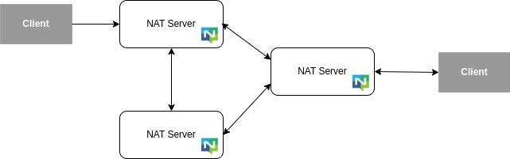
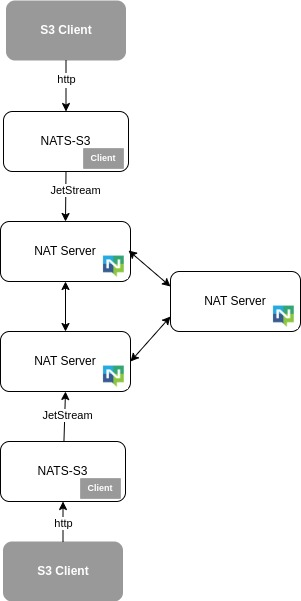

# NATS
NATS is a high‑performance distributed messaging system with pub/sub at its core and a
built‑in persistence layer (JetStream) enabling Streaming, Key‑Value, and Object Store.
It includes authentication/authorization, multi‑tenancy, and rich deployment topologies.




## NATS‑S3
Modern object stores like [MinIO](https://github.com/minio/minio),
[SeaweedFS](https://github.com/seaweedfs/seaweedfs), [JuiceFS](https://github.com/juicedata/juicefs),
and [AIStore](https://github.com/NVIDIA/aistore) expose S3‑compatible HTTP APIs for simple integration.
NATS‑S3 follows this approach to provide S3 access to NATS JetStream Object Store.




## Usage
Once `nats-s3` is running and connected to a NATS cluster, the NATS Object Store is
accessible via the S3 API. Examples below use the AWS CLI.

#### List NATS Buckets
```shell
$ aws s3 ls  --endpoint-url=http://localhost:5222
```

#### List content of NATS Bucket, bucket1
```shell
$ aws s3 ls s3://bucket1 --endpoint-url=http://localhost:5222
```

#### List content of NATS Bucket, bucket1
```shell
$ aws s3 ls s3://bucket1 --endpoint-url=http://localhost:5222
```

#### Upload an object to a NATS bucket
```shell
$ aws s3 cp file1.txt s3://bucket1 --endpoint-url=http://localhost:5222
```

#### Download an object from a NATS bucket
```shell
$ aws s3 cp s3://bucket1/file1.txt file1_copy.txt --endpoint-url=http://localhost:5222
```

## Build & Run
- Prereqs: Go 1.22+, a running NATS server (with JetStream enabled for Object Store).

Build
```shell
go build ./cmd/nats-s3
```

Run
```shell
./nats-s3 \
  --listen 0.0.0.0:5222 \
  --natsServers nats://127.0.0.1:4222 \
  --natsUser "" \
  --natsPassword ""
```

Flags
- `--listen`: HTTP bind address for the S3 gateway (default `0.0.0.0:5222`).
- `--natsServers`: Comma‑separated NATS server URLs (default from `nats.DefaultURL`).
- `--natsUser`, `--natsPassword`: Optional NATS credentials.

## Notes
- This gateway focuses on S3 object basics (list/get/head/put/delete). Many S3
  sub‑resources return 501 Not Implemented.
- Object keys with slashes are supported.


## Contributing

- See `CONTRIBUTING.md` for how to get started.

- Please follow our simple `CODE_OF_CONDUCT.md`.

